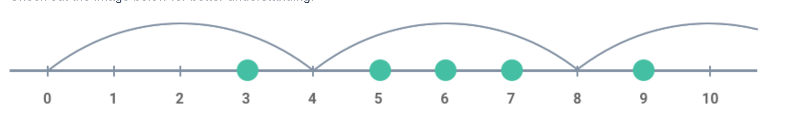
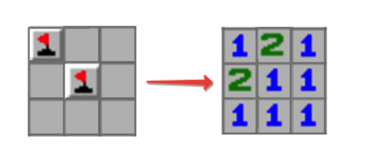
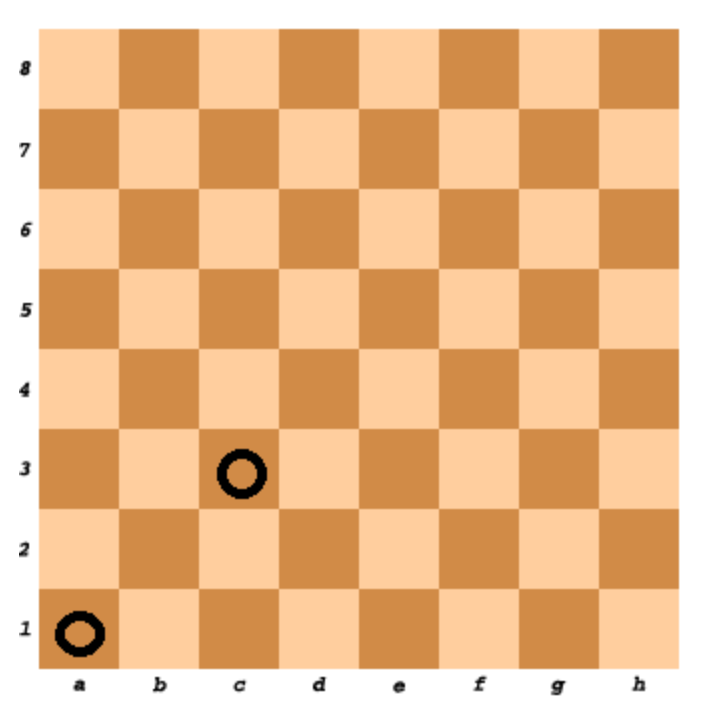
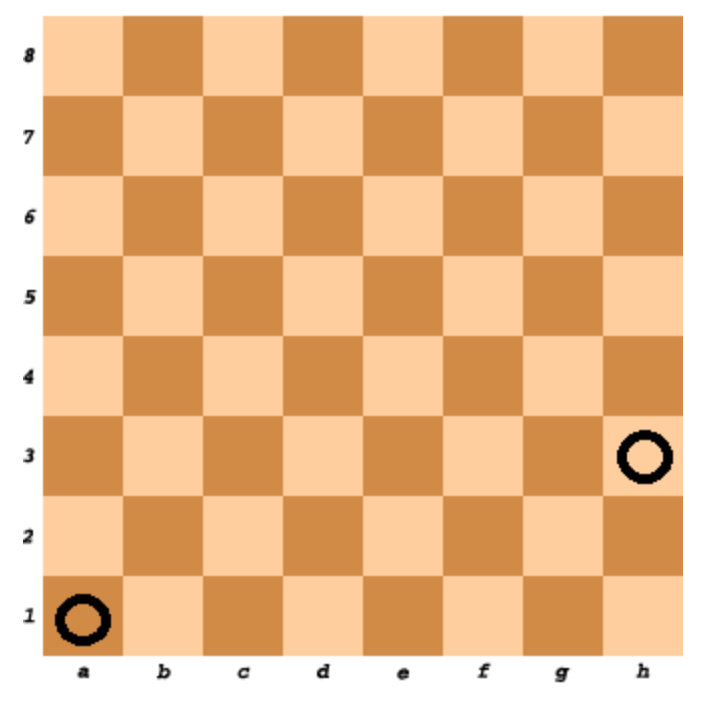

# 60 Algorithem-Problems sloved by TypeScript

Source: [codesignal.com](https://codesignal.com)

## 1- Add

Write a function that returns the sum of two numbers.

**Example:**

- For `param1 = 1` and `param2 = 2`, the output should be `solution(param1, param2) = 3`.

**Solution:**

```typescript
function solution (param1: number, param2: number): number {
    return param1 + param2 ;
}
```

[Test out the solution here](https://app.codesignal.com/arcade/intro/level-1/jwr339Kq6e3LQTsfa)

## 2- Century From Year

Given a year, return the century it is in. The first century spans from the year 1 up to and including the year 100, the second - from the year 101 up to and including the year 200, etc.

**Example:**

- For `year = 1905`, the output should be `solution(year) = 20`.
- For `year = 1700`, the output should be `solution(year) = 17`.

**Solution:**

```typescript
function solution(year: number): number {
    return Math.ceil(year / 100);
}
```

[Test out the solution here](https://app.codesignal.com/arcade/intro/level-1/egbueTZRRL5Mm4TXN)

## 3- Check Palindrome

Given the string, check if it is a palindrome.

**Example:**

- For `inputString = "aabaa"`, the output should be `solution(inputString) = true`.
- For `inputString = "abac"`, the output should be `solution(inputString) = false`.
- For `inputString = "a"`, the output should be `solution(inputString) = true`.

**Solution:**

```typescript
function solution(inputString: string): boolean {
    return inputString.split("").reverse().join("") === inputString ;
}
```

[Test out the solution here](https://app.codesignal.com/arcade/intro/level-1/s5PbmwxfECC52PWyQ)

## 4- Adjecent Elements Product

Given an array of integers, find the pair of adjacent elements that has the largest product and return that product.

**Example:**

- For `inputArray = [3, 6, -2, -5, 7, 3]`, the output should be `solution(inputArray) = 21`.
    `7` and `3` produce the largest product.

**Solution:**

```typescript
function solution(inputArray: number[]): number {
    let num:number = inputArray[0] * inputArray[1] ;
    for (let i in inputArray){
        let a = inputArray[+i] * inputArray[+i+1] ;
        if(a > num ) num = a ;
    }
    return num
}
```

[Test out the solution here](https://app.codesignal.com/arcade/intro/level-2/xzKiBHjhoinnpdh6m)

## 5- Shape Area

Below we will define an n-interesting polygon. Your task is to find the area of a polygon for a given n.

A 1-interesting polygon is just a square with a side of length 1. An n-interesting polygon is obtained by taking the n - 1-interesting polygon and appending 1-interesting polygons to its rim, side by side. You can see the 1-, 2-, 3- and 4-interesting polygons in the picture below:


**Example:**

- For `n = 2`, the output should be `solution(n) = 5`;
- For `n = 3`, the output should be `solution(n) = 13`.

**Solution:**

```typescript
function solution(n: number): number {
    return (n**2 + (n-1)**2);
}
```

[Test out the solution here](https://app.codesignal.com/arcade/intro/level-2/yuGuHvcCaFCKk56rJ)

## 6- Make Array Consecutive 2

Ratiorg got statues of different sizes as a present from CodeMaster for his birthday, each statue having an non-negative integer size. Since he likes to make things perfect, he wants to arrange them from smallest to largest so that each statue will be bigger than the previous one exactly by 1. He may need some additional statues to be able to accomplish that. Help him figure out the minimum number of additional statues needed.

**Example:**

- For `statues = [6, 2, 3, 8]`, the output should be `solution(statues) = 3`.
    Ratiorg needs statues of sizes `4`, `5` and `7`.

**Solution:**

```typescript
function solution(statues: number[]): number {
    statues.sort((a,b) => a-b) ;
    return statues[statues.length -1 ] - statues[0] +1 - statues.length ;
}

```

[Test out the solution here](https://app.codesignal.com/arcade/intro/level-2/bq2XnSr5kbHqpHGJC)

## 7- Almost Increasing Sequence

Given a sequence of integers as an array, determine whether it is possible to obtain a strictly increasing sequence by removing no more than one element from the array.

Note: sequence `a0`, `a1`, ..., `an` is considered to be a strictly increasing if `a0 < a1 < ... < an`. Sequence containing only one element is also considered to be strictly increasing.

**Example:**

- For `sequence = [1, 3, 2, 1]`, the output should be `solution(sequence) = false`.
   There is no one element in this array that can be removed in order to get a strictly increasing sequence.

For `sequence = [1, 3, 2]`, the output should be `solution(sequence) = true`.
   You can remove `3` from the array to get the strictly increasing sequence `[1, 2]`. Alternately, you can remove `2` to get the strictly increasing sequence `[1, 3]`.

**Solution:**

```typescript
// Will be added soon
```

[Test out the solution here](https://app.codesignal.com/arcade/intro/level-2/2mxbGwLzvkTCKAJMG)

## 8- Matrix Elements Sum

After becoming famous, the CodeBots decided to move into a new building together. Each of the rooms has a different cost, and some of them are free, but there's a rumour that all the free rooms are haunted! Since the CodeBots are quite superstitious, they refuse to stay in any of the free rooms, or any of the rooms below any of the free rooms.

Given `matrix`, a rectangular matrix of integers, where each value represents the cost of the room, your task is to return the total sum of all rooms that are suitable for the CodeBots (ie: add up all the values that don't appear below a `0`).

**Example:**

- For `matrix = [[0, 1, 1, 2],
                [0, 5, 0, 0],
                [2, 0, 3, 3]]`
   the output should be `solution(matrix) = 9`.

   

   There are several haunted rooms, so we'll disregard them as well as any rooms beneath them. Thus, the answer is `1 + 5 + 1 + 2 = 9`.

- For `matrix = [[1, 1, 1, 0],
                [0, 5, 0, 1],
                [2, 1, 3, 10]]`
   the output should be `solution(matrix) = 9`.

   

    Note that the free room in the final column makes the full column unsuitable for bots (not just the room directly beneath it). Thus, the answer is `1 +      1 + 1 + 5 + 1 = 9`.

**Solution:**

```typescript
function solution(matrix: number[][]): number {
    let sum:number = 0;
    let rem:number[] = []
    for(let i in matrix){
        for(let j in matrix[i]){
            if(!rem.includes(+j)) sum += matrix[i][j]
            if(matrix[i][j] === 0 ) {
                rem.push(+j)
                }
        }
    }
    return sum;
}
```

[Test out the solution here](https://app.codesignal.com/arcade/intro/level-2/xskq4ZxLyqQMCLshr)

## 9- All Longest Strings

Given an array of strings, return another array containing all of its longest strings.

**Example:**

- For `inputArray = ["aba", "aa", "ad", "vcd", "aba"]`, the output should be `solution(inputArray) = ["aba", "vcd", "aba"]`.

**Solution:**

```typescript
function solution(inputArray: string[]): string[] {
let max:number = 0
let outputArr:string[] = []
for(let i of inputArray){
    if(i.length > max) max = i.length
}
for(let i of inputArray) {
    if(i.length === max)outputArr.push(i)
}
return outputArr;
}
```

[Test out the solution here](https://app.codesignal.com/arcade/intro/level-3/fzsCQGYbxaEcTr2bL)

## 10- Common Character Count

Given two strings, find the number of common characters between them.

**Example:**

- For `s1 = "aabcc" and s2 = "adcaa"`, the output should be `solution(s1, s2) = 3`.
    Strings have `3` common characters - `2` "a"s and `1` "c".

**Solution:**

```typescript
function solution(s1: string, s2: string): number {
    let arr1:string[] = [...s1];
    let arr2:string[] = [...s2];
    let output:string = ''
    for(let i of arr1){
        if(arr2.includes(i)){
            output += i;
            arr2.splice(arr2.indexOf(i),1);
       }
    }
    return output.length
}
```

[Test out the solution here](https://app.codesignal.com/arcade/intro/level-3/JKKuHJknZNj4YGL32)

## 11- Is Lucky

Ticket numbers usually consist of an even number of digits. A ticket number is considered lucky if the sum of the first half of the digits is equal to the sum of the second half.

Given a ticket number `n`, determine if it's lucky or not.

**Example:**

- For `n = 1230`, the output should be `solution(n) = true`;
- For `n = 239017`, the output should be `solution(n) = false`.

**Solution:**

```typescript
function solution(n: number): boolean {
    let fh:number = 0;
    let sh:number = 0;
    let numArr:string[] = [...(String(n))];
    for(let i = 0; i < numArr.length/2 ; i++) fh += +numArr[i];
    for(let j = numArr.length/2; j < numArr.length; j++) sh += +numArr[j];
    return fh === sh;
}
```

[Test out the solution here](https://app.codesignal.com/arcade/intro/level-3/3AdBC97QNuhF6RwsQ)

## 12- Sort by Height

Some people are standing in a row in a park. There are trees between them which cannot be moved. Your task is to rearrange the people by their heights in a non-descending order without moving the trees. People can be very tall!

**Example:**

- For `a = [-1, 150, 190, 170, -1, -1, 160, 180]`, the output should be `solution(a) = [-1, 150, 160, 170, -1, -1, 180, 190]`.

**Solution:**

```typescript
function solution(a: number[]): number[] {
    let ph:number[] = [...a].sort((a,b)=> a -b).filter(el => el != -1)
    for(let i in a){
        if(a[i] != -1) a[i] = ph.splice(0,1)[0]
    }
    return a
}
```

[Test out the solution here](https://app.codesignal.com/arcade/intro/level-3/D6qmdBL2NYz49XHwM)

## 13- Reverse In Parentheses

Write a function that reverses characters in (possibly nested) parentheses in the input string.
Input strings will always be well-formed with matching `()`s.

**Example:**

- For `inputString = "(bar)"`, the output should be
    `solution(inputString) = "rab";`
- For `inputString = "foo(bar)baz", the output should be
    `solution(inputString) = "foorabbaz";`
- For `inputString = "foo(bar)baz(blim)", the output should be
    `solution(inputString) = "foorabbazmilb";`
- For `inputString = "foo(bar(baz))blim", the output should be
    `solution(inputString) = "foobazrabblim"`.
    Because `"foo(bar(baz))blim"` becomes `"foo(barzab)blim"` and then `"foobazrabblim".`


**Solution:**

```typescript
function solution(inputString: string): string {
    let regex = /\(([^()]*)\)/i;
    while (inputString.match(regex)) {
        inputString = inputString.replace(regex, (match, group) => group.split('').reverse().join(''));
    }
    return inputString;
}
```

[Test out the solution here](https://app.codesignal.com/arcade/intro/level-3/9DgaPsE2a7M6M2Hu6)

## 14- Alternating Sums

Several people are standing in a row and need to be divided into two teams. The first person goes into team 1, the second goes into team 2, the third goes into team 1 again, the fourth into team 2, and so on.

You are given an array of positive integers - the weights of the people. Return an array of two integers, where the first element is the total weight of team 1, and the second element is the total weight of team 2 after the division is complete.

**Example:**

- For `a = [50, 60, 60, 45, 70]`, the output should be
    `solution(a) = [180, 105]`.


**Solution:**

```typescript
function solution(a: number[]): number[] {
    let first: number = 0;
    let second: number = 0;
    a.forEach( (el , i) =>{
        i %2 === 0? first += el : second += el
    })
    return [ first, second ]
}
```

[Test out the solution here](https://app.codesignal.com/arcade/intro/level-4/cC5QuL9fqvZjXJsW9)

## 15- Add Border

Given a rectangular matrix of characters, add a border of asterisks(`*`) to it.

**Example:**

- For `picture = ["abc",
                  "ded"]`

the output should be

    `solution(picture) = ["*****",
                            "*abc*",
                            "*ded*",
                          "*****"]`


**Solution:**

```typescript
function solution(picture: string[]): string[] {
    let ast: string = "*".repeat(picture[0].length + 2)
    picture.forEach( (el, i) => picture[i] = `*${el}*`)
    return [ast,...picture,ast]
}

```

[Test out the solution here](https://app.codesignal.com/arcade/intro/level-4/ZCD7NQnED724bJtjN)

## 16- Are Similar?

Two arrays are called similar if one can be obtained from another by swapping at most one pair of elements in one of the arrays.

Given two arrays `a` and `b`, check whether they are similar.

**Example:**

- For `a = [1, 2, 3]` and `b = [1, 2, 3]`, the output should be
    `solution(a, b) = true`.

    The arrays are equal, no need to swap any elements.

- For `a = [1, 2, 3]` and `b = [2, 1, 3]`, the output should be
    `solution(a, b) = true`.

    We can obtain `b` from `a` by swapping `2` and `1` in `b`.

- For `a = [1, 2, 2]` and `b = [2, 1, 1]`, the output should be
    `solution(a, b) = false`.

    Any swap of any two elements either in `a` or in `b` won't make `a` and `b` equal.


**Solution:**

```typescript
function solution(a: number[], b: number[]): boolean {
    let na = []
    let nb = []
    for(let i = 0 ; i < a.length ; i ++){
        if(a[i]!=b[i]){
            na.push(a[i])
            nb.push(b[i])
        }
    }
  return na.length > 2? false
  : na.reverse().join('') == nb.join('')
}
```

[Test out the solution here](https://app.codesignal.com/arcade/intro/level-4/xYXfzQmnhBvEKJwXP)

## 17- arrayChange

You are given an array of integers. On each move you are allowed to increase exactly one of its element by one. Find the minimal number of moves required to obtain a strictly increasing sequence from the input.

**Example:**

- For `inputArray = [1, 1, 1]`, the output should be
`solution(inputArray) = 3`.


**Solution:**

```typescript
function solution(inputArray: number[]): number {
    let sum = 0
    for(let i in inputArray){
        if(inputArray[i] >= inputArray[+ i + 1]){
            let add = inputArray[i] - inputArray[+i+1] + 1
            sum += add
            inputArray[+i+1] += add
        }
    }
    return sum
}

```

[Test out the solution here](https://app.codesignal.com/arcade/intro/level-4/xvkRbxYkdHdHNCKjg)

## 18- palindromeRearranging

Given a string, find out if its characters can be rearranged to form a palindrome.

**Example:**

- For `inputString = "aabb"`, the output should be
`solution(inputString) = true`.

We can rearrange `"aabb"` to make `"abba"`, which is a palindrome.

**Solution:**

```typescript
function solution(inputString: string): boolean {
    let arr:string[] = [...inputString]
    let num = 0;
    let remArr = (arr:string[]) => arr.filter(val => val != arr[0])
    let isFirstEven = (arr:string[]) => arr.filter(val => val == arr[0]).length % 2 == 0
    if(isFirstEven(arr)){
        arr = remArr(arr)
    }
    if(!isFirstEven(arr)){
            num ++
            arr = remArr(arr)
            console.log(arr)
            if(!isFirstEven(arr)) num++
    }
    return num < 2
}
```

[Test out the solution here](https://app.codesignal.com/arcade/intro/level-4/Xfeo7r9SBSpo3Wico)

## 19- areEquallyStrong

Given a string, find out if its characters can be rearranged to form a palindrome.

**Example:**

- For `yourLeft = 10`, `yourRight = 15`, `friendsLeft = 15`, and `friendsRight = 10`, the output should be
    `solution(yourLeft, yourRight, friendsLeft, friendsRight) = true;`
    For `yourLeft = 15`, `yourRight = 10`, friendsLeft = 15, and friendsRight = 10, the output should be
    `solution(yourLeft, yourRight, friendsLeft, friendsRight) = true;`
    For `yourLeft = 15`, `yourRight = 10`, `friendsLeft = 15`, and `friendsRight = 9`, the output should be
    `solution(yourLeft, yourRight, friendsLeft, friendsRight) = false`.

**Solution:**

```typescript
function solution(yourLeft: number, yourRight: number, friendsLeft: number, friendsRight: number): boolean {
return (yourLeft > yourRight?yourLeft:yourRight) === (friendsLeft > friendsRight? friendsLeft:friendsRight) && (yourLeft < yourRight?yourLeft:yourRight) == (friendsLeft < friendsRight? friendsLeft:friendsRight)
}
```

[Test out the solution here](https://app.codesignal.com/arcade/intro/level-5/g6dc9KJyxmFjB98dL)


## 20- arrayMaximalAdjacentDifference

Given an array of integers, find the maximal absolute difference between any two of its adjacent elements.

**Example:**

- For `inputArray = [2, 4, 1, 0]`, the output should be
`solution(inputArray) = 3`.

**Solution:**

```typescript
function solution(inputArray: number[]): number {
let max = Math.abs(inputArray[0] - inputArray[1])
for(let i in inputArray){
    let newMax = Math.abs(inputArray[i] - inputArray [+i+1])
    if(newMax > max) max = newMax 
}
return max
}
```

[Test out the solution here](https://app.codesignal.com/arcade/intro/level-5/EEJxjQ7oo7C5wAGjE)

## 21- isIPv4Address

An IP address is a numerical label assigned to each device (e.g., computer, printer) participating in a computer network that uses the Internet Protocol for communication. There are two versions of the Internet protocol, and thus two versions of addresses. One of them is the IPv4 address.

Given a string, find out if it satisfies the IPv4 address naming rules.

**Example:**

- For `inputString = "172.16.254.1"`, the output should be
    `solution(inputString) = true`;

    For `inputString = "172.316.254.1"`, the output should be
    `solution(inputString) = false`.

    `316` is not in range `[0, 255]`.

    For `inputString = ".254.255.0"`, the output should be
    `solution(inputString) = false`.

    There is no first number.


**Solution:**

```typescript
function solution(inputString: string): boolean {
    let arr = inputString.split('.')
    let isV4 = true
    if(arr.length === 4){
        for(let i in arr) {
            console.log(+arr[i])
            if(+arr[i] < 0 || +arr[i] > 255 || arr[i] === '' || Number.isNaN(+arr[i]) || (arr[i][0] == '0' && arr[i][1] !=null ) ){
                 isV4 = false
            }
        }
    }
    else isV4 = false
    return isV4
}

```

[Test out the solution here](https://app.codesignal.com/arcade/intro/level-5/veW5xJednTy4qcjso)


## 22- avoidObstacles

You are given an array of integers representing coordinates of obstacles situated on a straight line.

Assume that you are jumping from the point with coordinate 0 to the right. You are allowed only to make jumps of the same length represented by some integer.

Find the minimal length of the jump enough to avoid all the obstacles.

**Example:**

- For inputArray = [5, 3, 6, 7, 9], the output should be
solution(inputArray) = 4.

Check out the image below for better understanding:


**Solution:**

```typescript
function solution(inputArray: number[]): number {
    let max: number = Math.max(...inputArray.sort((a, b) => a - b));
    let jump: number = 1;
    for (let i = 1; i <= max + 1 ; i++) {
      for(let j = 0; j < inputArray.length ; j++){
        if (inputArray[j] % jump === 0){
        jump = i;
      }
      }
    }
    return jump;
}
```

[Test out the solution here](https://app.codesignal.com/arcade/intro/level-5/XC9Q2DhRRKQrfLhb5)

## 23- Box Blur
Last night you partied a little too hard. Now there's a black and white photo of you that's about to go viral! You can't let this ruin your reputation, so you want to apply the box blur algorithm to the photo to hide its content.

The pixels in the input image are represented as integers. The algorithm distorts the input image in the following way: Every pixel `x` in the output image has a value equal to the average value of the pixel values from the `3 × 3` square that has its center at `x`, including `x` itself. All the pixels on the border of `x` are then removed.

Return the blurred image as an integer, with the fractions rounded down.
**Example:**

- For

image = [[1, 1, 1], 
         [1, 7, 1], 
         [1, 1, 1]]

the output should be `solution(image) = [[1]]`.

To get the value of the middle pixel in the input `3 × 3` square: `(1 + 1 + 1 + 1 + 7 + 1 + 1 + 1 + 1) = 15 / 9 = 1.66666 = 1`. The border pixels are cropped from the final result.

For

`image = [[7, 4, 0, 1], 
         [5, 6, 2, 2], 
         [6, 10, 7, 8], 
         [1, 4, 2, 0]]`

the output should be

`solution(image) = [[5, 4], 
                   [4, 4]]`

There are four `3 × 3` squares in the input image, so there should be four integers in the blurred output. To get the first value: `(7 + 4 + 0 + 5 + 6 + 2 + 6 + 10 + 7) = 47 / 9 = 5.2222 = 5`. The other three integers are obtained the same way, then the surrounding integers are cropped from the final result.

**Solution:**

```typescript
function solution(image: number[][]): number[][] {
      let l = image.length
  let elL = image[0].length
  let res = []
  for(let i = 0; i<= l - 3 ; i++){
    let eachEl = []
    for(let j = 0; j<= elL - 3 ; j++){
      let avg = Math.floor((image[i][j]+image[i][j+1]+image[i][j+2]+
                image[i+1][j]+image[i+1][j+1]+image[i+1][j+2]+
                image[i+2][j]+image[i+2][j+1]+image[i+2][j+2])/9)
      eachEl.push(avg)
    }
    res.push(eachEl)
  }
  return res
}
```

[Test out the solution here](https://app.codesignal.com/arcade/intro/level-5/5xPitc3yT3dqS7XkP)


## 24- Minesweeper

In the popular Minesweeper game you have a board with some mines and those cells that don't contain a mine have a number in it that indicates the total number of mines in the neighboring cells. Starting off with some arrangement of mines we want to create a Minesweeper game setup.

**Example:**

- For

`matrix = [[true, false, false],
          [false, true, false],
          [false, false, false]]`

the output should be

`solution(matrix) = [[1, 2, 1],
                    [2, 1, 1],
                    [1, 1, 1]]`

Check out the image below for better understanding:



**Solution:**

```typescript
function solution(m: boolean[][]): number[][] {
  const newMatrix = JSON.parse(JSON.stringify(m))

 for(let i = 0; i < m.length; i++){
   for(let j = 0 ; j < m[i].length; j++){
     
     const tl = m[i-1]?(m[i-1][j-1]?1:0):0
     const t = m[i-1]?(m[i-1][j]?1:0):0
     const tr = m[i-1]?(m[i-1][j+1]?1:0):0
     const l = m[i]?(m[i][j-1]?1:0):0
     const r = m[i]?(m[i][j+1]?1:0):0
     const bl = m[i+1]?(m[i+1][j-1]?1:0):0
     const b = m[i+1]?(m[i+1][j]?1:0):0
     const br = m[i+1]?(m[i+1][j+1]?1:0):0
     const num = tl+t+tr+l+r+bl+b+br
     newMatrix[i][j] = num
   }
 } 
  return newMatrix
}
```

[Test out the solution here](https://app.codesignal.com/arcade/intro/level-5/ZMR5n7vJbexnLrgaM)

## 25- Array Replace

Given an array of integers, replace all the occurrences of `elemToReplace` with `substitutionElem`.

**Example:**

- For `inputArray = [1, 2, 1]`, `elemToReplace = 1`, and `substitutionElem = 3`, the output should be
`solution(inputArray, elemToReplace, substitutionElem) = [3, 2, 3]`.


**Solution:**

```typescript
function solution(inputArray: number[], elemToReplace: number, substitutionElem: number): number[] {
const res = inputArray.map( el => {
    if(el === elemToReplace) return substitutionElem
    else return el
})
return res
}
```

[Test out the solution here](https://app.codesignal.com/arcade/intro/level-6/mCkmbxdMsMTjBc3Bm)


## 26- evenDigitsOnly

Check if all digits of the given integer are even.

**Example:**

- For `n = 248622`, the output should be
    `solution(n) = true`;
- For `n = 642386`, the output should be
    `solution(n) = false`.


**Solution:**

```typescript
function solution(n: number): boolean {
const str = [...n.toString()]
const res = str.map(each => {
   return parseInt(each) % 2 === 0? true:false
})
return !res.includes(false)
}
```

[Test out the solution here](https://app.codesignal.com/arcade/intro/level-6/6cmcmszJQr6GQzRwW)

## 27- variableName

Correct variable names consist only of English letters, digits and underscores and they can't start with a digit.

Check if the given string is a correct variable name.

**Example:**

- For `name = "var_1__Int"`, the output should be
    `solution(name) = true`;
- For `name = "qq-q"`, the output should be
    `solution(name) = false`;
- For `name = "2w2"`, the output should be
    `solution(name) = false`.


**Solution:**

```typescript
function solution(name: string): boolean {
const reg = /^[a-zA-Z_][a-zA-Z0-9_]*$/
return reg.test(name);
}
```

[Test out the solution here](https://app.codesignal.com/arcade/intro/level-6/6Wv4WsrsMJ8Y2Fwno)


## 28- alphabeticShift

Given a string, your task is to replace each of its characters by the next one in the English alphabet; i.e. replace `a` with `b`, replace `b` with `c`, etc (`z` would be replaced by `a`).

**Example:**

For `inputString = "crazy"`, the output should be `solution(inputString) = "dsbaz"`.

**Solution:**

```typescript

function solution(inputString: string): string {
const alphabet = [...'abcdefghijklmnopqrstuvwxyz']
const res = [...inputString].map( each => {
  let num = alphabet.indexOf(each.toLowerCase())+1
  console.log(num)
  if(num >= 26) num = num - 26
    return each = alphabet[num]
})
return res.join('')
}
```

[Test out the solution here](https://app.codesignal.com/arcade/intro/level-6/PWLT8GBrv9xXy4Dui)


## 29- chessBoardCellColor

Given two cells on the standard chess board, determine whether they have the same color or not.

**Example:**

- For `cell1 = "A1"` and `cell2 = "C3"`, the output should be
`solution(cell1, cell2) = true`.



- For `cell1 = "A1"` and `cell2 = "H3"`, the output should be
`solution(cell1, cell2) = false`.



**Solution:**

```typescript
function solution(cell1: string, cell2: string): boolean {
const blackSquers = {a:'o',b:'e',c:'o',d:'e',e:'o',f:'e',g:'o',h:'e'}
const char1 = cell1[0].toLowerCase()
const char2 = cell2[0].toLowerCase()
const num1Status = parseInt(cell1[1]) % 2 === 0
const num2Status = parseInt(cell2[1]) % 2 === 0
const isBlack  = (cell,status)=>blackSquers[cell] === 'o' && !status || blackSquers[cell] === 'e' && status 

let c1  = isBlack(char1,num1Status)?'black':'white'
let c2  = isBlack(char2,num2Status)?'black':'white'
return c1 === c2
}
```

[Test out the solution here](https://app.codesignal.com/arcade/intro/level-6/t97bpjfrMDZH8GJhi)


## 30- chessBoardCellColor

Consider integer numbers from `0` to `n - 1` written down along the circle in such a way that the distance between any two neighboring numbers is equal (note that `0` and `n - 1` are neighboring, too).

Given `n` and `firstNumber`, find the number which is written in the radially opposite position to `firstNumber`.

**Example:**

- For `n = 10` and `firstNumber = 2`, the output should be
`solution(n, firstNumber) = 7`.


**Solution:**

```typescript
function solution(n: number, firstNumber: number): number {
    return firstNumber >= n/2? firstNumber - n/2 : firstNumber + n/2
}
```

[Test out the solution here](https://app.codesignal.com/arcade/intro/level-7/vExYvcGnFsEYSt8nQ)


## 31- depositProfit

You have deposited a specific amount of money into your bank account. Each year your balance increases at the same growth `rate`. With the assumption that you don't make any additional deposits, find out how long it would take for your balance to pass a specific `threshold`.

**Example:**

- For `deposit = 100`, `rate = 20`, and `threshold = 170`, the output should be
`solution(deposit, rate, threshold) = 3`.

Each year the amount of money in your account increases by `20%`. So throughout the years, your balance would be:

    year 0: `100`;
    year 1: `120`;
    year 2: `144`;
    year 3: `172.8`.

Thus, it will take `3` years for your balance to pass the `threshold`, so the answer is `3`.


**Solution:**

```typescript
function solution(deposit: number, rate: number, threshold: number): number {
    let res = deposit
    let year = 0
do{
    res += res * (rate/100)
    year++
}while(threshold > res)
return year
}
```

[Test out the solution here](https://app.codesignal.com/arcade/intro/level-7/8PxjMSncp9ApA4DAb)


## 32- absoluteValuesSumMinimization

Given a sorted array of integers `a`, your task is to determine which element of `a` is closest to all other values of `a`. In other words, find the element `x` in `a`, which minimizes the following sum:

`abs(a[0] - x) + abs(a[1] - x) + ... + abs(a[a.length - 1] - x)`

(where `abs` denotes the absolute value)

If there are several possible answers, output the smallest one.

**Example:**

- For `a = [2, 4, 7]`, the output `should be solution(a) = 4`.
        for `x = 2`, the value will be `abs(2 - 2) + abs(4 - 2) + abs(7 - 2) = 7`.
        for `x = 4`, the value will be `abs(2 - 4) + abs(4 - 4) + abs(7 - 4) = 5`.
        for `x = 7`, the value will be `abs(2 - 7) + abs(4 - 7) + abs(7 - 7) = 8`.

    The lowest possible value is when `x = 4`, so the answer is `4`.

- For `a = [2, 3]`, the output should be `solution(a) = 2`.
        for `x = 2`, the value will be `abs(2 - 2) + abs(3 - 2) = 1`.
        for `x = 3`, the value will be `abs(2 - 3) + abs(3 - 3) = 1`.

    Because there is a tie, the smallest `x` between `x = 2` and `x = 3` is the answer.

**Solution:**

```typescript
function solution(a: number[]): number {
    let n;
    if(a.length % 2 !== 0){
        n = (a.length - 1) / 2
    }else{
        n = (a.length / 2) - 1
    }
    return a[n]
}
```

[Test out the solution here](https://app.codesignal.com/arcade/intro/level-7/ZFnQkq9RmMiyE6qtq)


## 33- stringsRearrangement

Given an array of equal-length strings, you'd like to know if it's possible to rearrange the order of the elements in such a way that each consecutive pair of strings differ by exactly one character. Return true if it's possible, and `false` if not.

Note: You're only rearranging the order of the strings, not the order of the letters within the strings!

**Example:**

- For `inputArray = ["aba", "bbb", "bab"]`, the output should be
    `solution(inputArray) = false`.

    There are 6 possible arrangements for these strings:
        - `["aba", "bbb", "bab"]`
        - `["aba", "bab", "bbb"]`
        - `["bbb", "aba", "bab"]`
        - `["bbb", "bab", "aba"]`
        - `["bab", "bbb", "aba"]`
        - `["bab", "aba", "bbb"]`

    None of these satisfy the condition of consecutive strings differing by 1 character, so the answer is `false`.

    For `inputArray = ["ab", "bb", "aa"]`, the output should be
    `solution(inputArray) = true`.

    It's possible to arrange these strings in a way that each consecutive pair of strings differ by 1 character (eg: `"aa", "ab", "bb"` or `"bb", "ab", "aa"`), so return `true`.


**Solution:**

```typescript

```

[Test out the solution here](https://app.codesignal.com/arcade/intro/level-7/PTWhv2oWqd6p4AHB9)


## 34- extractEachKth

Given array of integers, remove each 'k^th' element from it.

Note: You're only rearranging the order of the strings, not the order of the letters within the strings!

**Example:**

- For `inputArray = [1, 2, 3, 4, 5, 6, 7, 8, 9, 10]` and `k = 3`, the output should be
`solution(inputArray, k) = [1, 2, 4, 5, 7, 8, 10]`.


**Solution:**

```typescript
function solution(inputArray: number[], k: number): number[] {
    if(k === 0 || k === 1) return []
    return inputArray.filter( (item, i) => ( i + 1) % k !== 0 )
}
```

[Test out the solution here](https://app.codesignal.com/arcade/intro/level-8/3AgqcKrxbwFhd3Z3R)