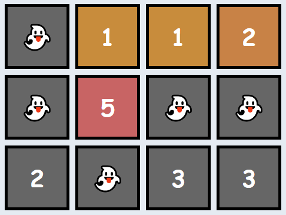

# 60 Algorithem-Problems sloved by TypeScript

Source: [codesignal.com](https://codesignal.com)

## 1- Add

Write a function that returns the sum of two numbers.

**Example:**

- For `param1 = 1` and `param2 = 2`, the output should be `solution(param1, param2) = 3`.

**Solution:**

```typescript
function solution (param1: number, param2: number): number {
    return param1 + param2 ;
}
```

[Test out the solution here](https://app.codesignal.com/arcade/intro/level-1/jwr339Kq6e3LQTsfa)

## 2- Century From Year

Given a year, return the century it is in. The first century spans from the year 1 up to and including the year 100, the second - from the year 101 up to and including the year 200, etc.

**Example:**

- For `year = 1905`, the output should be `solution(year) = 20`.
- For `year = 1700`, the output should be `solution(year) = 17`.

**Solution:**

```typescript
function solution(year: number): number {
    return Math.floor((year - 1) / 100) + 1 ;
}
```

[Test out the solution here](https://app.codesignal.com/arcade/intro/level-1/egbueTZRRL5Mm4TXN)

## 3- Check Palindrome

Given the string, check if it is a palindrome.

**Example:**

- For `inputString = "aabaa"`, the output should be `solution(inputString) = true`.
- For `inputString = "abac"`, the output should be `solution(inputString) = false`.
- For `inputString = "a"`, the output should be `solution(inputString) = true`.

**Solution:**

```typescript
function solution(inputString: string): boolean {
    return inputString.split("").reverse().join("") == inputString ;
}
```

Link to the problem number 3 for testing: [Test out the solution here](https://app.codesignal.com/arcade/intro/level-1/s5PbmwxfECC52PWyQ)

## 4- Adjecent Elements Product

Given an array of integers, find the pair of adjacent elements that has the largest product and return that product.

**Example:**

- For `inputArray = [3, 6, -2, -5, 7, 3]`, the output should be `solution(inputArray) = 21`.
    `7` and `3` produce the largest product.

**Solution:**

```typescript
function solution(inputArray: number[]): number {
    let num:number = inputArray[0] * inputArray[1] ;
    for (let i in inputArray){
        let a = inputArray[+i] * inputArray[+i+1] ;
        if(a > num ) num = a ;
    }
    return num
}
```

[Test out the solution here](https://app.codesignal.com/arcade/intro/level-2/xzKiBHjhoinnpdh6m)

## 5- Shape Area

Below we will define an n-interesting polygon. Your task is to find the area of a polygon for a given n.

A 1-interesting polygon is just a square with a side of length 1. An n-interesting polygon is obtained by taking the n - 1-interesting polygon and appending 1-interesting polygons to its rim, side by side. You can see the 1-, 2-, 3- and 4-interesting polygons in the picture below:



**Example:**

- For `n = 2`, the output should be `solution(n) = 5`;
- For `n = 3`, the output should be `solution(n) = 13`.

**Solution:**

```typescript
function solution(n: number): number {
    return (n**2 + (n-1)**2);
}
```

[Test out the solution here](https://app.codesignal.com/arcade/intro/level-2/yuGuHvcCaFCKk56rJ)

## 6- Make Array Consecutive 2

Ratiorg got statues of different sizes as a present from CodeMaster for his birthday, each statue having an non-negative integer size. Since he likes to make things perfect, he wants to arrange them from smallest to largest so that each statue will be bigger than the previous one exactly by 1. He may need some additional statues to be able to accomplish that. Help him figure out the minimum number of additional statues needed.

**Example:**

- For `statues = [6, 2, 3, 8]`, the output should be `solution(statues) = 3`.
    Ratiorg needs statues of sizes `4`, `5` and `7`.

**Solution:**

```typescript
function solution(statues: number[]): number {
    statues.sort((a,b) => a-b) ;
    return statues[statues.length -1 ] - statues[0] +1 - statues.length ;
}

```

[Test out the solution here](https://app.codesignal.com/arcade/intro/level-2/bq2XnSr5kbHqpHGJC)

## 7- Almost Increasing Sequence

Given a sequence of integers as an array, determine whether it is possible to obtain a strictly increasing sequence by removing no more than one element from the array.

Note: sequence `a0`, `a1`, ..., `an` is considered to be a strictly increasing if `a0 < a1 < ... < an`. Sequence containing only one element is also considered to be strictly increasing.

**Example:**

- For `sequence = [1, 3, 2, 1]`, the output should be `solution(sequence) = false`.
   There is no one element in this array that can be removed in order to get a strictly increasing sequence.

For `sequence = [1, 3, 2]`, the output should be `solution(sequence) = true`.
   You can remove `3` from the array to get the strictly increasing sequence `[1, 2]`. Alternately, you can remove `2` to get the strictly increasing sequence `[1, 3]`.

**Solution:**

```typescript
// Will be added soon
```

[Test out the solution here](https://app.codesignal.com/arcade/intro/level-2/2mxbGwLzvkTCKAJMG)

## 8- Matrix Elements Sum

After becoming famous, the CodeBots decided to move into a new building together. Each of the rooms has a different cost, and some of them are free, but there's a rumour that all the free rooms are haunted! Since the CodeBots are quite superstitious, they refuse to stay in any of the free rooms, or any of the rooms below any of the free rooms.

Given `matrix`, a rectangular matrix of integers, where each value represents the cost of the room, your task is to return the total sum of all rooms that are suitable for the CodeBots (ie: add up all the values that don't appear below a `0`).

**Example:**

- For `matrix = [[0, 1, 1, 2],
                [0, 5, 0, 0],
                [2, 0, 3, 3]]`
   the output should be `solution(matrix) = 9`.

   

   There are several haunted rooms, so we'll disregard them as well as any rooms beneath them. Thus, the answer is `1 + 5 + 1 + 2 = 9`.

- For `matrix = [[1, 1, 1, 0],
                [0, 5, 0, 1],
                [2, 1, 3, 10]]`
   the output should be `solution(matrix) = 9`.

   

    Note that the free room in the final column makes the full column unsuitable for bots (not just the room directly beneath it). Thus, the answer is `1 +      1 + 1 + 5 + 1 = 9`.

**Solution:**

```typescript
function solution(matrix: number[][]): number {
    let sum:number = 0;
    let rem:number[] = []
    for(let i in matrix){
        for(let j in matrix[i]){
            if(!rem.includes(+j)) sum += matrix[i][j]
            if(matrix[i][j] == 0 ) {
                rem.push(+j)
                }
        }
    }
    return sum;
}
```

[Test out the solution here](https://app.codesignal.com/arcade/intro/level-2/xskq4ZxLyqQMCLshr)

## 9- All Longest Strings

Given an array of strings, return another array containing all of its longest strings.

**Example:**

- For `inputArray = ["aba", "aa", "ad", "vcd", "aba"]`, the output should be `solution(inputArray) = ["aba", "vcd", "aba"]`.

**Solution:**

```typescript
function solution(inputArray: string[]): string[] {
let max:number = 0
let outputArr:string[] = []
for(let i of inputArray){
    if(i.length > max) max = i.length
}
for(let i of inputArray) {
    if(i.length == max)outputArr.push(i)
}
return outputArr;
}
```

[Test out the solution here](https://app.codesignal.com/arcade/intro/level-3/fzsCQGYbxaEcTr2bL)

## 10- Common Character Count

Given two strings, find the number of common characters between them.

**Example:**

- For `s1 = "aabcc" and s2 = "adcaa"`, the output should be `solution(s1, s2) = 3`.
    Strings have `3` common characters - `2` "a"s and `1` "c".

**Solution:**

```typescript
function solution(s1: string, s2: string): number {
    let arr1:string[] = [...s1];
    let arr2:string[] = [...s2];
    let output = ''
    for(let i of arr1){
        if(arr2.includes(i)){
            output += i;
            arr2.splice(arr2.indexOf(i),1);
       }
    }
    return output.length
}
```

[Test out the solution here](https://app.codesignal.com/arcade/intro/level-3/JKKuHJknZNj4YGL32)

## 11- Is Lucky

Ticket numbers usually consist of an even number of digits. A ticket number is considered lucky if the sum of the first half of the digits is equal to the sum of the second half.

Given a ticket number `n`, determine if it's lucky or not.

**Example:**

- For `n = 1230`, the output should be `solution(n) = true`;
- For `n = 239017`, the output should be `solution(n) = false`.

**Solution:**

```typescript
function solution(n: number): boolean {
    let fh:number = 0;
    let sh:number = 0;
    let numArr:string[] = [...(String(n))];
    for(let i = 0; i < numArr.length/2 ; i++) fh += +numArr[i];
    for(let j = numArr.length/2; j < numArr.length; j++) sh += +numArr[j];
    return fh == sh;
}
```

[Test out the solution here](https://app.codesignal.com/arcade/intro/level-3/3AdBC97QNuhF6RwsQ)

## 12- Sort by Height

Some people are standing in a row in a park. There are trees between them which cannot be moved. Your task is to rearrange the people by their heights in a non-descending order without moving the trees. People can be very tall!

**Example:**

- For `a = [-1, 150, 190, 170, -1, -1, 160, 180]`, the output should be `solution(a) = [-1, 150, 160, 170, -1, -1, 180, 190]`.

**Solution:**

```typescript
function solution(a: number[]): number[] {
    let ph:number[] = [...a].sort((a,b)=> a -b).filter(el => el != -1)
    for(let i in a){
        if(a[i] != -1) a[i] = ph.splice(0,1)[0]
    }
    return a
}
```

[Test out the solution here](https://app.codesignal.com/arcade/intro/level-3/D6qmdBL2NYz49XHwM)
