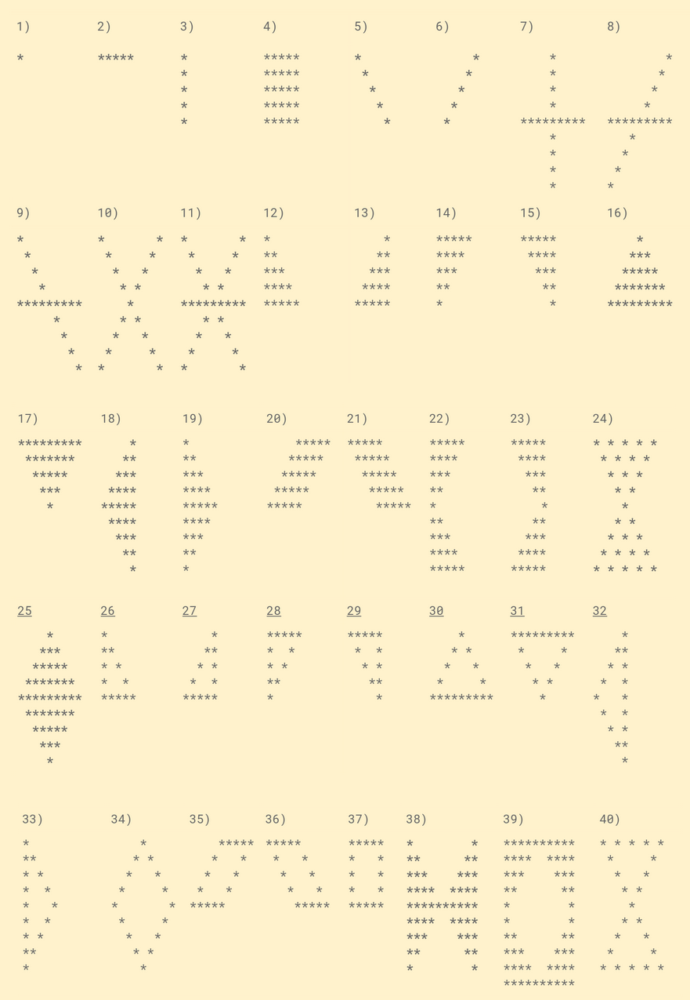

# 40 patterns of asterisks with JavaScript

asterisks.png


**Pattern 1:**

```javascript
function pattern1 () {
    console.log('*')
}
pattern1()
```

**Output:**

`
*
`

**Pattern 2:**

```javascript
function pattern2 (n) {
    let row ='';
    for (let i = 0; i < n; i++) {
        row += '*';
    }
    console.log(row);
}
pattern2(5)
```

**Output:**

`
*****
`

**Pattern 3:**

```javascript
function pattern3 (n) {
    let row ='*';
    let col = '';
    for (let i = 0; i < n; i++) {
        col += '*' + '\n';
    }
    console.log(col);
}
pattern3(5)
```

**Output:**

`
*
*
*
*
*
`

**Pattern 4:**

```javascript
function pattern4 (n) {
    let col = '';
    for (let i = 0; i < n; i++) {
        let row ='';
        for (let j = 0; j < n; j++) {
            row +="*"
        }
        col += row + '\n';
    }
    console.log(col);
}
pattern4(5)
```

**Output:**

`
*****
*****
*****
*****
*****
`
