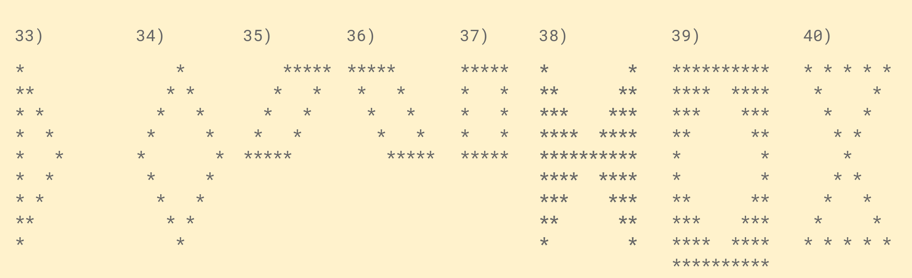

# Asterisks patterns with JavaScript for beginner developers

- For all the functions `n = 5`.
- You can try every function in [jsbin](https://jsbin.com/?js,console).
- If you have any suggestions feel free to open a PR.
- Link to the YouTube video: [Asterisk Patterns](https://youtu.be/uXUG90OrV3Y).
## **You can find each pattern's function by it's number:**





---

**Pattern 1:**

```js
function pattern1 () {
    console.log('*')
}
pattern1()
```

**Output:**

```txt
*
```

---

**Pattern 2:**

```js
function pattern3 (n) {
    for (let i = 0; i < n; i++) {
        console.log('*');
    }
}
pattern3(5)
```

**Output:**

```txt
*
*
*
*
*
```

---

**Pattern 3:**

```js
function pattern2 (n) {
    let row ='';
    for (let i = 0; i < n; i++)
        row += '*';
    console.log(row);
}
pattern2(5)
```

**Output:**

```txt
*****
```

---

**Pattern 4:**

```js
function pattern4 (n) {
    let col = '';
    for (let i = 0; i < n; i++) {
        let row ='';
        for (let j = 0; j < n; j++)
            row +="*";
        col += row + '\n';
    }
    console.log(col);
}
pattern4(5)
```

**Output:**

```txt
*****
*****
*****
*****
*****
```

---

**Pattern 5:**

```js
function pattern5 (n) {
    let col = '';
    for (let i = 0; i < n; i++) {
        let row = '';
        for (let j = 0; j < n; j++)
            if(j === i)
                row += '*';
            else 
                row += ' ';
        col += row + '\n';
    }
    console.log(col);
}
pattern5(5)
```

**Output:**

```txt
*
 *
  *  
   * 
    *
```

---

**Pattern 6:**

```js
function pattern6(n) {
    let col = '';
    for (let i = 0; i < n; i++) {
        let row = '';
        for (let j = 0; j < n; j++)
            if(j === n - i)
                row += '*';
            else 
                row += ' ';
        col += row + '\n';
    }
    console.log(col);
}
pattern6(5)
```

**Output:**

```txt
    *
   *
  *  
 * 
*
```

---

**Pattern 7:**

```js
function pattern7(n) {
    let col = '';
    for (let i = 1; i <= 2 * n - 1; i++) {
        let row = ''
        for (let j = 1; j <= 2 * n - 1; j++)
            if( i === n || j === n)
                row += '*';
            else 
                row += ' ';
        col += row + '\n';
    }
    console.log(col);
}
pattern7(5)
```

**Output:**

```txt
    *
    *
    *
    *
*********
    *
    *
    *
    *
```

---

**Pattern 8:**

```js
function pattern8(n) {
    console.log("nere's tne pattern:");
    let col = '';
    for (let i = 1; i < 2 * n; i++) {
        let row = '';
        for (let j = 1; j < 2 * n; j++) {
            if( i === n || j === 2 * n - i)
                row += '*';
            else 
                row += ' ';
        }
        col += row + '\n';
    }
    console.log(col);
}

pattern8(5)
```

**Output:**

```txt
        *
       *
      *
     *
*********
   *
  *
 *
*
```

---

**Pattern 9:**

```js
function pattern9(n) {
    console.log("nere's tne pattern:");
    let col = '';
    for (let i = 1; i < 2 * n; i++) {
        let row = '';
        for (let j = 1; j < 2 * n; j++)
            if( i === n || i === j)
                row += '*';
            else 
                row += ' ';
        col += row + '\n';
    }
    console.log(col);
}
pattern9(5)
```

**Output:**

```txt
*
 *
  *
   *
*********
     *
      *
       *
        *
```

---

**Pattern 10:**

```js
function pattern10(n) {
    let col = '';
    for (let i = 1; i < 2 * n; i++) {
        let row = '';
        for (let j = 1; j < 2 * n; j++)
            if(j === i || j === 2 * n - i)
                row += '*';
            else 
                row += ' ';
        col += row + '\n';
    }
    console.log(col);
}

pattern10(5)
```

**Output:**

```txt
*       *
 *     *
  *   *
   * *
    *
   * *
  *   *
 *     *
*       *
```

---

**Pattern 11:**

```js
function pattern11(n) {
    let col = '';
    for (let i = 1; i < 2 * n; i++) {
        let row = '';
        for (let j = 1; j < 2 * n; j++)
            if(j === i || j === 2 * n - i || i === n)
                row += '*';
            else 
                row += ' ';
        col += row + '\n';
    }
    console.log(col);
}

pattern11(5)
```

**Output:**

```txt
*       *
 *     *
  *   *
   * *
*********
   * *
  *   *
 *     *
*       *  
```

---

**Pattern 12:**

```js
function pattern12 (n) {
    let col = '';
    for (let i = 1; i <= n; i++) {
       let row = '';
        for (let j = 1; j <= i; j++) {
            row += '*';
        }
        col += row + '\n';
    } 
    console.log(col);
}

pattern12(5)
```

**Output:**

```txt
*
**
***
****
*****
```

---

**Pattern 13:**

```js
function pattern13 (n) {
    let col = '';
    for (let i = 1; i <= n; i++) {
       let row = ''
        for (let j = 1 ; j <= n; j++) 
            if (j > n - i) 
                row +='*';
            else 
                row +=' ';
        col +=row + '\n';
    } 
    console.log(col);
}

pattern13(5)
```

**Output:**

```txt
    *
   **
  ***
 ****
***** 
```

---

**Pattern 14:**

```js
function pattern14 (n) {
    let col = '';
    for (let i = 0; i < n; i++) {
       let asterisks = '';
        for (let j = 0; j < n - i; j++)
            asterisks += '*';
        col += asterisks + '\n';
    } 
    console.log(col);
}

pattern14(5)
```

**Output:**

```txt
*****
****
***
**
* 
```

---

**Pattern 15:**

```js
function pattern15 (n) {
    let col = '';
    for (let i = 0; i < n; i++) {
        let row = ''
        for (let j = 0; j <= n; j++) 
            if (j > i) 
                row += '*';
            else 
                row += ' ';
    col += row + '\n';
    } 
    console.log(col);
}
pattern15(5)
```

**Output:**

```txt
*****
 ****
  ***
   **
    *
```

---

**Pattern 16:**

```js
function pattern16(n) {
    let col = '';
    for (let i = 1; i <= n; i++) {
        let row = '';
        for (let j = 1; j <= 2 * n; j++) 
            if(j > n - i && j < n + i) 
                row+= '*' ;
            else 
                row += ' ';
        col += row + '\n';
    }
    console.log(col);
}

pattern16(5)
```

**Output:**

```txt
    *
   ***
  *****
 *******
*********
```

---

**Pattern 17:**

```js
function pattern17(n) {
    let col = '';
    for (let i = 1; i <= n; i++) {
        let row = '';
        for (let j = 1; j < 2 * n; j++)
            if(j >= i && j <= 2 * n - i) 
                row += '*';
            else 
                row += ' ';
        col +=  row + '\n';
    }
    console.log(col);
}

pattern17(5)
```

**Output:**

```txt
*********
 *******
  *****
   ***
    *

```

---

**Pattern 18:**

```js
function pattern18(n) {
    let col = '';
    for (let i = 1; i <= 2 * n; i++) {
        let row = '';
        for (let j = 1; j <= n; j++) 
        if( ( i <= n && j> n - i) || (i>n && j >= i - n) ) 
            row +='*';
        else 
            row +=' ';
        col += row + '\n';
    }
    console.log(col);
}

pattern18(5)
```

**Output:**

```txt
    *
   **
  ***
 ****
*****
 ****
  ***
   **
    *
```

---

**Pattern 19:**

```js
function pattern19(n) {
    let col = '';
    for (let i = 1; i < 2 * n; i++) {
        let row = '';
            for (let j = 1; j <= n; j++) 
                if( ( i <= n && j <= i) || (i>n && j <= 2 * n - i) ) 
                    row +='*';
                else 
                    row +=' ';
        col += row + '\n';
    }
    console.log(col);
}

pattern19(5)
```

**Output:**

```txt
*
**
***
****
*****
****
***
**
*
```

---

**Pattern 20:**

```js
function pattern20(n) {
    let col = '';
    for (let i = 1; i <= n; i++) {
        let row = ''
        for (let j = 1; j <= 2 * n; j++)
            if (j > n - i && j < 2 * n - i)
                row += '*';
            else 
                row += ' ';
        col += row + '\n';
    }
    console.log(col);
}

pattern20(5)
```

**Output:**

```txt
    *****
   *****
  *****
 *****
*****
```

---

**Pattern 21:**

```js
function pattern21(n) {
    let col = '';
    for (let i = 1; i <= n; i++) {
        let row = '';
        for (let j = 1; j < 2 * n; j++)
            if (j >= i && j < i + n)
                row += '*';
            else 
                row += ' ';
        col += row + '\n';
    }
    console.log(col);
}

pattern21(5)
```

**Output:**

```txt
*****
 *****
  *****
   *****
    *****
```

---

**Pattern 22:**

```js
function pattern22(n) {
    let col = '';
    for (let i = 1; i < 2 * n; i++) {
        let row = '';
        for (let j = 1; j <= n; j++) 
            if((i <= n && j<= n - i +1) || (i > n && j <= i - n +1)) 
                row += "*";
            else 
                row += " ";
        col +=  row + '\n';
    }
    console.log(col);
}

pattern22(5)
```

**Output:**

```txt
*****
****
***
**
*
**
***
****
*****
```

---

**Pattern 23:**

```js
function pattern23(n) {
    let col = '';
    for (let i = 1; i < 2 * n; i++) {
        let row = '';
        for (let j = 1; j <= n; j++) 
            if((i <= n && j >= i) || (i > n && j >= 2 * n - i)) 
                row += "*";
            else 
                row += " ";
        col +=  row + '\n';
    }
    console.log(col);
}
pattern23(5)
```

**Output:**

```txt
*****
 ****
  ***
   **
    *
   **
  ***
 ****
*****
```

---

**Pattern 24:**

```js
function pattern24(n) {
    let col = '';
    for (let i = 1; i < 2 * n; i++) {
        let row = '';
        for (let j = 1; j <= n; j++)
            if(i <= n && j >= i || i > n && j >= 2 * n - i) 
                row += "* ";
            else 
                row += " ";
        col += row + '\n' 
    }
    console.log(col);
}
pattern24(5)
```

**Output:**

```txt
* * * * *
 * * * *
  * * *
   * *
    *
   * *
  * * *
 * * * *
* * * * *
```

---

**Pattern 25:**

```js
function pattern25(n) {
    let col = '';
    for (let i = 1; i < 2 * n; i++) {
        let row = '';
        for (let j = 1; j < 2 * n; j++)
            if(i <= n && j > n - i && j < n + i || i > n && j > i - n && j < 3*n - i) 
                row += '*';
            else 
                row += ' ';
        col += row + '\n';
    }
    console.log(col);
}
pattern25(5)
```

**Output:**

```txt
     *
    ***
   *****
  *******
 *********
  *******
   *****
    ***
     *
```

---

**Pattern 26:**

```js
function pattern26(n) {
    let col = '';
    for (let i = 1; i <= n; i++) {
        let row = '';
        for (let j = 1; j <= n; j++)
            if ( j === 1 || i === n || i === j ) 
                row += '*';
            else 
                row += ' ';
        col += row + '\n';
    }
    console.log(col);
}
pattern26(5)
```

**Output:**

```txt
*
** 
* * 
*  *
*****
```

---

**Pattern 37:**

```js
function pattern27(n) {
    let col = '';
    for (let i = 1; i <= n; i++) {
        let row = '';
        for (let j = 1; j <= n; j++)
            if ( j === n || i === n || j === n - i +1 ) 
                row += '*';
            else 
                row += ' ';
        col += row + '\n';
    }
    console.log(col);
}
pattern27(5)
```

**Output:**

```txt
    *
   ** 
  * * 
 *  *
*****
```

---

**Pattern 28:**

```js
function pattern28(n) {
    let col = '';
    for (let i = 1; i <= n; i++) {
        let row = '';
        for (let j = 1; j <= n  ; j++)
            if ( i === 1 || j === 1 || j === n - i + 1) 
                row += '*';
            else 
                row += ' ';      
        col += row + '\n';
    }
    console.log(col);
}
pattern28(5)
```

**Output:**

```txt
*****
*  *
* *
** 
*
```

---

**Pattern 29:**

```js
function pattern29(n) {
    let col = '';
    for (let i = 1; i <= n; i++) {
        let row = '';
        for (let j = 1; j <= n; j++)
            if ( j === n || i === 1 || i === j ) 
                row += '*';
            else 
                row += ' ';
        col += row + '\n';
    }
    console.log(col);
}
pattern29(5)
```

**Output:**

```txt

*****
 *  *
  * * 
   ** 
    *

```

---

**Pattern 30:**

```js
function pattern30(n) {
    let col = '';
    for (let i = 1; i <= n; i++) {
        let row = '';
        for (let j = 1; j < 2 * n; j++)
            if ( i === n || j === n - i +1  || j === n + i -1 )
                row += '*';
            else 
                row += ' ';
        col += row + '\n'; 
    }
    console.log(col);
}
pattern30(5)
```

**Output:**

```txt
    *
   * * 
  *   * 
 *     *
*********
```

---

**Pattern 31:**

```js
function pattern31(n) {
    let col = '';
    for (let i = 1; i <= n; i++) {
        let row = '';
        for (let j = 1; j < 2 * n; j++)
            if ( i === 1 || j === i  || j === 2 * n - i  )
                row += '*';
            else 
                row += ' ';
        col += row + '\n'; 
    }
    console.log(col);
}
pattern31(5)
```

**Output:**

```txt
*********
 *     *
  *   * 
   * * 
    *
```

---

**Pattern 32:**

```js
function pattern32(n) {
    let col = '';
    for (let i = 1; i < 2 * n; i++) {
        let row = '';
        for (let j = 1; j <= n; j++)
            if ( j === n || j === n - i +1 || j === i - n +1 )
                row += '*';
            else 
                row += ' ';
        col += row + '\n'; 
    }
    console.log(col);
}
pattern32(5)
```

**Output:**

```txt
    *
   ** 
  * * 
 *  *
*   * 
 *  *
  * * 
   ** 
    *
```

---

**Pattern 33:**

```js
function pattern33(n) {
    let col = '';
    for (let i = 1; i < 2 * n; i++) {
        let row = '';
        for (let j = 1; j <= n; j++)
            if ( j === 1 || j === i || j === 2 * n-i  )
                row += '*';
            else 
                row += ' ';
        col += row + '\n'; 
    }
    console.log(col);
}
pattern33(5)
```

**Output:**

```txt
*
** 
* * 
*  *
*   * 
*  *
* * 
** 
*
```

---

**Pattern 34:**

```js
function pattern34(n) {
    let col = '';
    for (let i = 1; i < 2 * n; i++) {
        let row = '';
        for (let j = 1; j < 2 * n; j++)
            if ( j === n - i + 1 || j === n + i -1 || j === i - n +1 || j === 3 * n - i -1  )
                row += '*';
            else 
                row += ' ';
        col += row + '\n'; 
    }
    console.log(col);
}
pattern34(5)
```

**Output:**

```txt
     *
    * * 
   *   * 
  *     *
 *       * 
  *     *
   *   * 
    * * 
     *
```

---

**Pattern 35:**

```js
function pattern35(n) {
    let col = '';
    for (let i = 1; i <= n; i++) {
        let row = '';
        for (let j = 1; j < 2 * n; j++)
            if (j === n - i +1 || j === 2 * n - i || i === 1 && j > n || i === n && j < n )
                row += '*';
            else 
                row += ' ';
        col += row + '\n'; 
    }
    console.log(col);
}
pattern35(5)
```

**Output:**

```txt
    *****
   *   * 
  *   * 
 *   *
***** 
```

---

**Pattern 36:**

```js
function pattern36(n) {
    let col = '';
    for (let i = 1; i <= n; i++) {
        let row = '';
        for (let j = 1; j < 2 * n; j++)
            if ( i === 1 && j <= n  ||i === n && j >= n   || j === i || j === n + i -1  )
                row += '*';
            else 
                row += ' ';
        col += row + '\n'; 
    }
    console.log(col);
}
pattern36(5)
```

**Output:**

```txt
*****
 *   *
  *   *
   *   *
    *****
```

---

**Pattern 37:**

```js
function pattern37(n) {
    let col = '';
    for (let i = 1; i <= n; i++) {
        let row = '';
        for (let j = 1; j <= n; j++)
            if(i === 1 || i === n || j === 1|| j === n)
                row += '*';
            else 
                row += ' ';
        col += row + '\n';
    }
    console.log(col);
}

pattern37(5)
```

**Output:**

```txt
*****
*   *
*   *
*   *
*****
```

---

**Pattern 38:**

```js
function pattern38(n) {
    let col = '';
    for (let i = 1; i < 2 * n; i++) {
        let row = '';
        for (let j = 1; j < 2 * n; j++)
            if (i <= n && j > i && j < 2 * n - i || i > n && j > 2 * n - i && j < i)
                row += ' ';
            else 
                row += '*';
        col += row + '\n';
    }
    console.log(col);
}
pattern38(5)
```

**Output:**

```txt

*       *
**     **
***   ***
**** ****
*********
**** ****
***   ***
**     **
*       *
```

---

**Pattern 39:**

```js
function pattern39(n) {
    let col = '';
    for (let i = 1; i <= 2 * n; i++) {
        let row = '';
        for (let j = 1; j <= 2 * n; j++)
            if(i <= n && j <= n - i + 1 || j >= n + i || i > n && j <= i - n || j >3 * n - i) 
                row += '*';
            else 
                row += ' ';
        col += row + '\n';
    }
    console.log(col);
}
pattern39(5)
```

**Output:**

```txt
**********
****  ****
***    ***
**      **
*        *
*        *
**      **
***    ***
****  ****
**********
```

---

**Pattern 40:**

```js
function pattern40(n) {
    let col = '';
    for (let i = 1; i < 2 * n; i++) {
        let row = '';
        for (let j = 1; j < 2 * n; j++)
            if(i === 1 || i === 2 * n - 1 || j === i || j === 2 * n - i)
                row += '*';
            else 
                row += ' ';
        col += row + '\n';
    }
    console.log(col);
}
pattern40(5)
```

**Output:**

```txt
*********
 *     *
  *   *
   * *
    *
   * *
  *   *
 *     *
*********  
```
